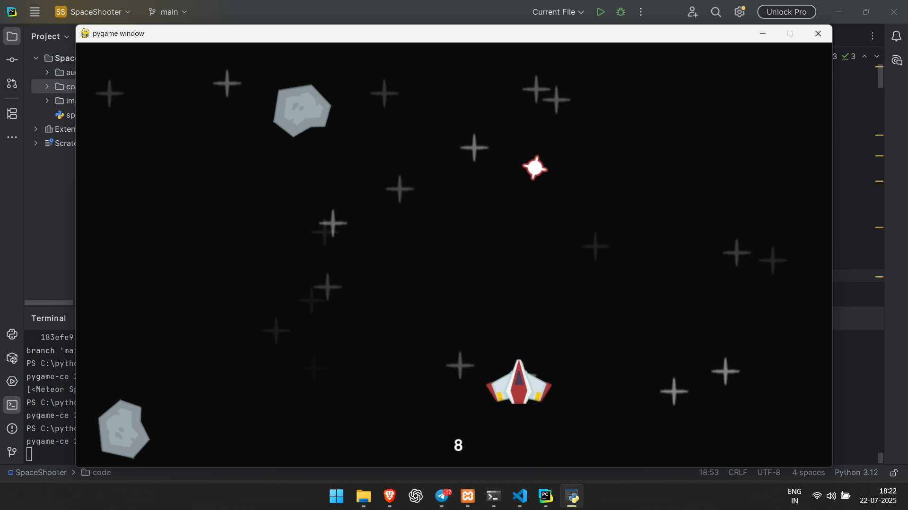

# 🚀 Space Shooter

A simple **space shooter game** built with Python and Pygame.  
Fly your spaceship, shoot incoming enemies, and survive as long as you can!

 <!-- Add your own screenshot or GIF here -->

## ✨ Features

- Player spaceship movement and shooting
- Enemies spawning and moving toward the player
- Score tracking
- Game over screen

## 📦 Installation

1. **Clone the repository:**
   ```bash
   git clone https://github.com/Kkoderr/SpaceShooter.git
   cd SpaceShooter
   ```
2. Install dependencies:
  ```bash
  pip install pygame
  ```
## ▶️ How to Play
Run the game:
```bash
python main.py
```
Controls:
← / → : Move left or right
Space : Shoot

## 🛠 Built With
- Python
- Pygame

## 📄 License
This project is licensed under the MIT License. See LICENSE for details.

## 🌟 Contributing
-Pull requests are welcome!
-Feel free to open an issue or suggest features.

If you enjoy the game, leave a ⭐️ to show your support!
